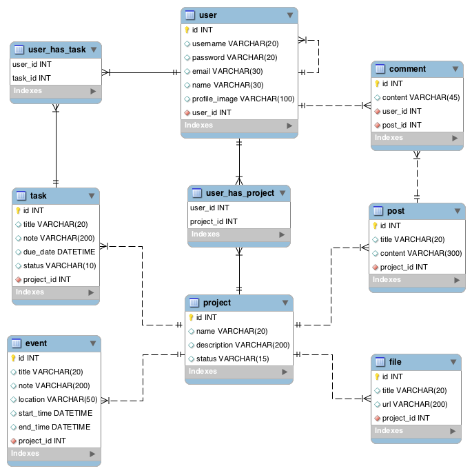

# OneChain
OneChain is a powerful integrated platform for project management and task collaboration.

## Database Schema

## Features

- [Sign up, Sign in and Sign out](https://github.com/3archers/onechain-ios/issues/2)
- [User Profile and Contacts](https://github.com/3archers/onechain-ios/issues/5)
- [Projects](https://github.com/3archers/onechain-ios/issues/6)
    - [Tasks](https://github.com/3archers/onechain-ios/issues/7)
    - [Events](https://github.com/3archers/onechain-ios/issues/18)
    - [Posts](https://github.com/3archers/onechain-ios/issues/16)
    - [Files (Photos)](https://github.com/3archers/onechain-ios/issues/21)

## License

    Copyright [2016] [3archers]

    Licensed under the Apache License, Version 2.0 (the "License");
    you may not use this file except in compliance with the License.
    You may obtain a copy of the License at

        http://www.apache.org/licenses/LICENSE-2.0

    Unless required by applicable law or agreed to in writing, software
    distributed under the License is distributed on an "AS IS" BASIS,
    WITHOUT WARRANTIES OR CONDITIONS OF ANY KIND, either express or implied.
    See the License for the specific language governing permissions and
    limitations under the License.
